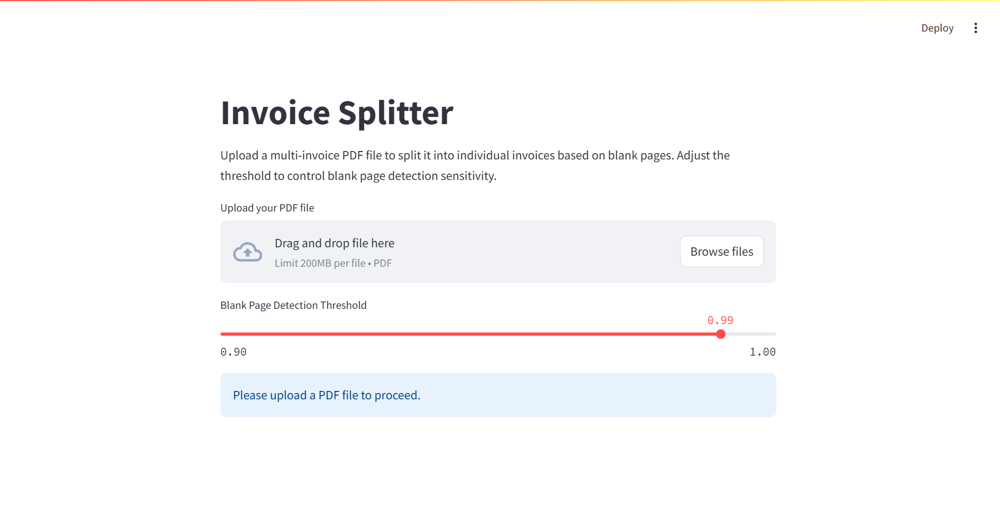

Invoice PDF Splitter
This Python script splits a multi-invoice PDF file into individual invoice PDFs, using blank pages as separators. It includes both a command-line interface (CLI) and a graphical user interface (GUI) built with Streamlit.
Requirements

Python 3.8+
Libraries: See requirements.txt
Poppler: Required for pdf2image. Install via:
Linux: sudo apt-get install poppler-utils
Mac: brew install poppler
Windows: Download from a trusted source and add to PATH

Installation

Clone or download this repository.
Create and activate a virtual environment:python -m venv venv
.\venv\Scripts\activate  # Windows
source venv/bin/activate  # Linux/Mac

Install dependencies:pip install -r requirements.txt

Ensure poppler is installed and added to your system PATH.

Generating a Test PDF
To create a sample multi_invoice.pdf for testing:

Ensure reportlab is installed (included in requirements.txt).
Run:python generate_test_pdf.py

This generates multi_invoice.pdf with 8 pages (2-page invoice, blank, 1-page invoice, blank, 3-page invoice).

Usage
Command-Line Interface (CLI)
Run the script from the command line:
python split_pdf.py multi_invoice.pdf --threshold 0.99

multi_invoice.pdf: Path to the input PDF.
--threshold: (Optional) Blank page detection threshold (0 to 1, default 0.99).
Output PDFs are saved in output_invoices/.
Logs are saved to split_log.txt.

Graphical User Interface (GUI)
Run the Streamlit app:
streamlit run app.py

Open the provided URL (e.g., http://localhost:8501) in your browser.
Upload a PDF file.
Adjust the threshold using the slider (0.90 to 1.00).
Click "Split PDF" to process the file.
Download the resulting invoices and view the split log.

Example
For a PDF with 8 pages (2-page invoice, blank, 1-page invoice, blank, 3-page invoice):

Output: invoice_1.pdf (pages 1–2), invoice_2.pdf (page 4), invoice_3.pdf (pages 6–8).

